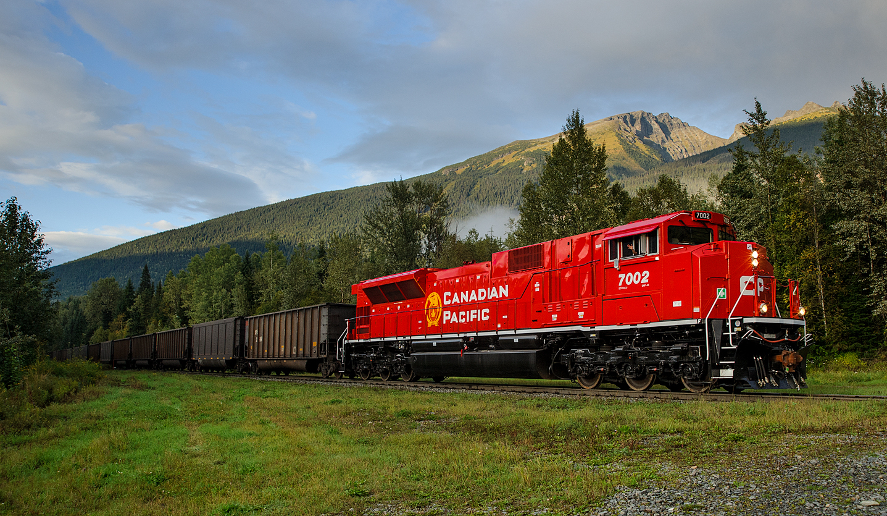

# Train System - Ex01a - Classes, Objects, and Composition

> This is the first of a set of exercises that follow the evolution of a console program to manage trains.

## Overview

Your task is to generate a set of simple data types to represent the primary objects for managing trains.

Use the demos presented in class as a guide to implementing this exercise.

For this exercise, place all the required data types in the namespace `TrainSystem` and ensure that they are `public`. 

Create your project as a Console Application (.NET 5). From the terminal when your working directory is `src` type the following commands:

```csharp
# From the src/ folder
dotnet new sln -n TrainWatch
dotnet new console -n TrainSystem
dotnet sln "TrainWatch.sln" add TrainSystem\TrainSystem.csproj
```

To ensure that your web application works, build and run your project.

```csharp
# From the src/ folder
cd TrainSystem
dotnet build
dotnet run
```

The resulting output should be "Hello World".

Alternately you could build and run from the *src/* folder. If you would like to test this out first make sure you are in the *src/* folder and then type `dotnet build "TrainWatch.sln"`. At this point, you could continue either with VS Code (type `dotnet run -p TrainSystem\TrainSystem.csproj` from the *src/* folder) or use VS 2019 by double-clicking the "TrainWatch.sln" in windows file explorer.

### General Validation Rules

All validation is to be performed by throwing exceptions. Here are some general requirements.

- Exceptions must have meaningful error messages.
- Error messages must include details about the limits for acceptable values.
- Weights must always be positive and non-zero whole numbers. Weights are to be in 100 pound increments (all weights are in pounds).
- All string information must contain text. Null, empty, and plain white-space text is not allowed. Sanitize your strings by trimming the leading and trailing whitespace.

### The `Engine`

Engines are the workhorse of the railway system. For our purposes, we need to track the train engine's **Model** (e.g.: "CP 8002"), **Serial Number** (e.g.: "48807"), **Weight** (in pounds, e.g.: 147,700), and **Horse Power** (e.g.: 4400). All of this must be stored as read-only information (it cannot be modified). You will need a greedy constructor for this type. 

Create a file called "Engine.cs" in the TrainSystem directory and then in the file a class called "Engine" that has the following fields, and constructor. You must complete the constructor as per the specs of an engine.

Override the **`ToString()`** method to return the Engine's data, as shown below.

```csharp
using System;
namespace TrainSystem
{
    public class Engine
    {
        public readonly string Model;
        public readonly string SerialNumber;
        public readonly int Weight;
        public readonly int HorsePower;

        public Engine(string model, string serialNumber, int weight, int horsePower) {}

        public override string ToString()
        {
            return $"Engine Model: {Model}, Serial Number: {SerialNumber}, Weight: {Weight}, Horse Power: {HorsePower}";
        }
    }
}
```

Note the following:

- Horse Power must be a positive whole number between 3500 and 5500. Horse Power is measured in 100 HP increments.



### The `Train`

A train is a set of railcars pulled by an engine. In this Ex01a we will only create an engine. 

Create a file called "Train.cs" in the TrainSystem directory and then in the file a class called "Train" that has the following properties and constructor. You must complete the constructor.

```csharp
using System;
using System.Collections.Generic;

namespace TrainSystem
{
    public class Train
    {
        public Engine Engine { get; private set; }

        public Train(Engine engine) {}
    }
}
```
### The `Program`

Replace the contents of Program.cs with the following.
  
```csharp
using System;
using System.Collections.Generic;
using System.IO;

namespace TrainSystem
{
    class Program
    {
        static void Main(string[] args)
        {
            var app = new Program();
            app.Ex01a();
        }

        private void Ex01a()
        {
            try
            {
                Console.WriteLine("Ex01a Program started");
                //build a simple train with only an engine.
                Engine theEngine = new Engine("CP 8002","123658",147700,4400);
                Train theTrain = new Train(theEngine);
                //print out the train components to the console, even though now its just an engine.
                Console.WriteLine(theTrain.Engine.ToString());
                Console.WriteLine("Ex01a Program ended");
                Console.WriteLine("");
            }
            catch (System.Exception ex)
            {
                Console.WriteLine($"Exception in Ex01a: {ex.Message}");
            }
            
        }
    }
}
```
## Credits

- [Engine Image](./CP-7002-TStevens.jpg) - [Source](https://www.thedieselshop.us/CP.HTML)
