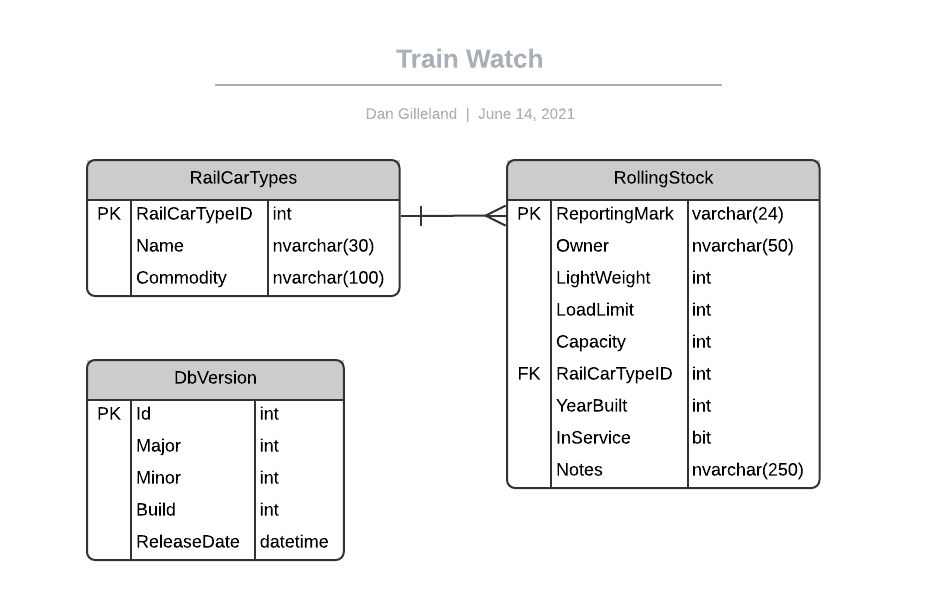

# Train Watch - Ex04 - Web Server (Back-End) Setup and Database Access via the About Page

> This is the **second** in a series of exercises where you will be building a website to manage information on trains. **Train Watch** is a community site for train lovers who want to keep up-to-date on trains across North America. They want to maintain a database of Engines and RailCars.
>
> **This set is cumulative**; future exercises in this series will build upon previous exercises.

## Overview

You are to create an additional project for the Entity, DLL, and BLL classes. You will also be creating a new page to test that the database configuration has been set up correctly.

Use the demos presented in class as a guide to implementing this exercise.
### Install Database

A new database called [TrainWatch](./TrainWatch.dacpac) has been supplied to you for this exercise. 

Use Microsoft SQL Management Studio to deploy the TrainWatch.dacpac file to the database.

### Server (Back-End) Set Up

In this task, you will be creating an additional project for the "back-end" of the application and ensuring your solution follows rudimentary Client-Server architecture.

```csharp
# From the src/ folder
# Create a Class Library which will be the Web Server (Back-End)
dotnet new classlib -n TrainWatchApp -o TrainWatch.App
# Allow the webapp project to use the classlib project by referencing it.
dotnet add TrainWatch.Web/TrainWatchWeb.csproj reference TrainWatch.App/TrainWatchApp.csproj
# Add the project to the solution
dotnet sln "TrainWatch.sln" add TrainWatch.App\TrainWatchApp.csproj
```

To ensure that your web application works, build and run your project.

```csharp
# From the src/ folder
cd TrainWatch.Web
dotnet build
dotnet watch run
```

Alternately you could build and run from the *src/* folder. If you would like to test this out first make sure you are in the *src/* folder and then type `dotnet build "TrainWatch.sln"`. At this point, you could continue either with VS Code (type `dotnet watch run -p TrainWatch.Web\TrainWatch.csproj` from the *src/* folder) or use VS 2019 by double-clicking the "TrainWatch.sln" in windows file explorer.

### Entity Framework

We will be using the **Microsoft.EntityFrameworkCore.SqlServer** NuGet package to connect to this database. Add this NuGet package to the class library project.

```csharp
# From the src/ folder
cd TrainWatch.App
dotnet add package Microsoft.EntityFrameworkCore.SqlServer
```

### Server Framework

Inside your class library `TrainWatch.App`, create three folders: "Entities", "DAL", and "BLL". 

### Entities

In the "Entities" folder, create a file called `DbVersion.cs` and create the appropriate class to model the database `DbVersion` table in the ***TrainWatch*** database. You can use the following ERD to guide your coding, but you should always remember to confirm the model's structure with the actual tables in the database.



Make sure to make the namespace as follows:  `namespace TrainWatch.Entities`.

For the `DbVersion` entity, override the `.ToString()` method to display the version information as a string. Use an appropriate formatting - one that would be suitable for either web or console applications.

### DAL Context

In the "DAL" folder, create a file called `TrainWatchContext.cs` which will contain the `TrainWatchContext` class and ensure it inherits from `DbContext`:

```csharp
using Microsoft.EntityFrameworkCore;
using TrainWatch.Entities;

namespace TrainWatch.DAL {
//DAL is short for Data Access Layer
    public class TrainWatchContext : DbContext {
        //constructor
        //inject the options which will tell the database context class where to access the database
        public TrainWatchContext(DbContextOptions<TrainWatchContext> options)
            : base(options) {}
        public DbSet<DbVersion> DbVersion { get; set; }
    }
}
```
### BLL Services

In the "BLL" folder of your class library and add the file `TrainWatchServices.cs` that will hold the class `TrainWatchServices`. This class must have a constructor that requires an instance of the `TrainWatchContext` class.

In this class, create a public method called `GetDbVersion()` that has no parameters and returns an instance of the `DbVersion` entity. The related database table should only have one row, so you can return that first item from the database context.

```csharp
using System;
using System.Collections.Generic;
using Microsoft.EntityFrameworkCore;
using System.Linq;
using TrainWatch.Entities;
using TrainWatch.DAL;

namespace TrainWatch.Services 
{
    public class TrainWatchServices 
    {
        private readonly TrainWatchContext Context;
        public TrainWatchServices(TrainWatchContext context) {
            if (context == null)
                throw new ArgumentNullException();
            Context = context;
        }

        public DbVersion GetDbVersion() 
        {
            //You must complete this method.
        }
```
### Register Context and Services

You must configure the following services in your webapp.

- `TrainWatchContext` class as a DbContext using SQL Server
- `TrainWatchServices` class as a transient service

#### DOTNET 5
In the startup.cs file include the following:
```csharp
//using statements added
using Microsoft.EntityFrameworkCore;
using TrainWatch.Services;
using TrainWatch.DAL;

namespace TrainWatch

public void ConfigureServices(IServiceCollection services)
    {
        services.AddRazorPages();

        //TrainWatchContext class as a DbContext using SQL Server
        services.AddDbContext<TrainWatchContext>(context => 
            context.UseSqlServer(Configuration.GetConnectionString("TWDB")));
        
        //TrainWatchServices class as a transient service
        services.AddTransient<TrainWatchServices>();
    }
```
#### DOTNET 6
In the Program.cs file include the following:
```csharp
//using statements added
using Microsoft.EntityFrameworkCore;
using TrainWatch.Services;
using TrainWatch.DAL;

var builder = WebApplication.CreateBuilder(args);

// Add services to the container.
builder.Services.AddRazorPages();

// Get the connection string.
var connectionString = builder.Configuration.GetConnectionString("TWDB");
// TrainWatchContext class as a DbContext using SQL Server
builder.Services.AddDbContext<TrainWatchContext>(context => 
    context.UseSqlServer(connectionString));
// TrainWatchServices class as a transient service
builder.Services.AddTransient<TrainWatchServices>();

var app = builder.Build();
```
NOTE: The new code must be between the `builder.Services.AddRazorPages();` and `var app = builder.Build();`

### Setup Connection String In `appsettings.json`

In addition, you will need to set up the database connection string in the `appsettings.json` file:

```csharp
"ConnectionStrings": {
    "TWDB" : "Server=.;Database=TrainWatch;Integrated Security=true;"
  },
```
### Create The `About` Page

Create an `About.cshtml`/`About.cshtml.cs` Razor Page to display the database version information. The Page Model class must declare in its constructor a dependency on the `TrainWatchServices` class. 

On this page, display the database version information from the DbVersion table of the database.

```csharp
# From the src/ folder
cd TrainWatch.Web
dotnet new page -n About -o Pages
```

Be sure to add a menu item so that this page can be navigated to using the main menu; use the text "About" for the link.

To ensure that your web application works, build and run your project.

```csharp
# From the src/ folder
cd TrainWatch.Web
dotnet build
dotnet watch run
```
## Research Notes and Credits

- [Rail Car Types](https://www.up.com/customers/track-record/tr181121_rail_car_types.htm)
- [Rail Car Types and What They Carry](https://youtu.be/ARr-LJCj2tg) **(video)**
  - Source of data for the `RailCarTypes` database table
- RR Picture Archives:
  - [Northern Alberta Railways Box Cars](http://www.rrpicturearchives.net/rsList.aspx?id=NAR&cid=2)
  - [Alberta Government Covered Hoppers](http://www.rrpicturearchives.net/rsList.aspx?id=ALNX&cid=4)
  - [Assorted Ore Cars](http://www.rrpicturearchives.net/rsList.aspx?cid=32)
  - [Canadian National Railways](http://www.rrpicturearchives.net/Railroad.aspx?id=CN) (and following links for Rolling Stock Roster)
- [Reporting Marks](https://en.wikipedia.org/wiki/List_of_reporting_marks:_C)
